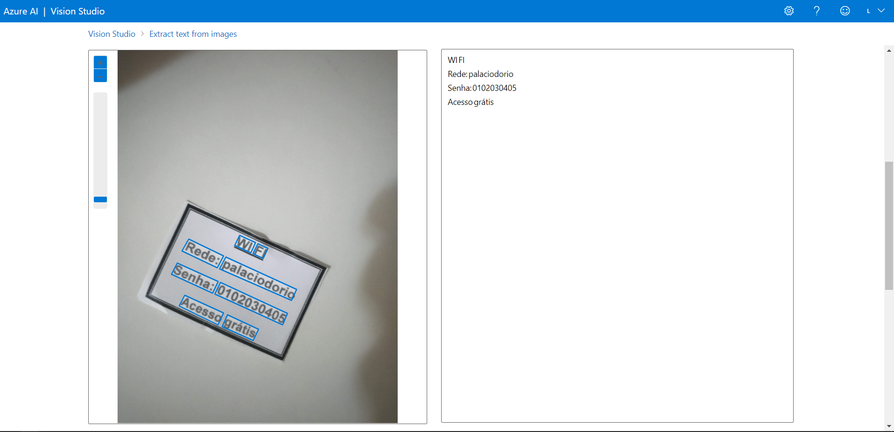
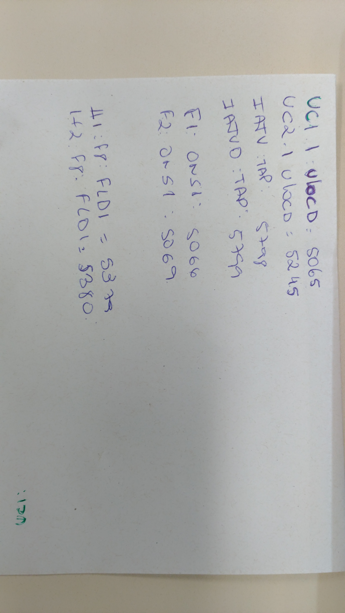

# azure-ai-ocr-hands-on
Azure's OCR hands-on 

Read text in Vision Studio is the Lab 05 from Microsoft Learning. It has an environment setup that is a lot simpler than Lab 01. Just following the [tutorial](https://microsoftlearning.github.io/mslearn-ai-fundamentals/Instructions/Labs/05-ocr.html) you will have an OCR with some pictures to test. Furthermore, you can upload your pictures like I did it.

## Beginning with a simple trick

I know that reading a printed text is more simple to computer vision algorithms, so I started with an angled text just to provide some easy challenge. Check the original picture:


And now the visual output in Vision Studio:



The recognized text was:

```
WIFI
Rede:palaciodorio
Senha:0102030405
Acessográtis
```

Finally, the JSON with the blues rectangles coordinates is in 'output/wifi_angle.json'. You can see the snippet with the object related to the "<u>WI FI</u>" ahead:

```json
  {
    "lines": [
      {
        "text": "WI FI",
        "boundingPolygon": [
          {
            "x": 1790,
            "y": 2724
          },
          {
            "x": 2208,
            "y": 2920
          },
          {
            "x": 2130,
            "y": 3062
          },
          {
            "x": 1720,
            "y": 2872
          }
        ],
        "words": [
          {
            "text": "WI",
            "boundingPolygon": [
              {
                "x": 1789,
                "y": 2724
              },
              {
                "x": 2024,
                "y": 2831
              },
              {
                "x": 1955,
                "y": 2980
              },
              {
                "x": 1720,
                "y": 2870
              }
            ],
            "confidence": 0.99
          },
          {
            "text": "FI",
            "boundingPolygon": [
              {
                "x": 2057,
                "y": 2846
              },
              {
                "x": 2205,
                "y": 2916
              },
              {
                "x": 2136,
                "y": 3064
              },
              {
                "x": 1987,
                "y": 2995
              }
            ],
            "confidence": 0.959
          }
        ]
      }     
```
## Some ugly manuscript

Now I make the OCR cry to translate my manuscript that even I cried to do it.



The output text was:

```
UCI1ULOCD:5065
UC2.1ULOCD:524.5
IATV:TAP:
5798
JATUO:TAP:5799
FI:ONS1:5066
F.2:0+51:5069
41:48:FLDI=5379
1+2.Fr:FLDI=5380
:170
```

The original text intended to say (😂):
```
UC1.1:ULOCD:5065
UC2.1:ULOCD:5245
IATV:TAP:5798
IATVD:TAP:5799
F1:0NS1:5066
F2:0NS1:5069
41:48:FLDI=5379
1+2.F8:FLDI=5380
:170
```

They are pretty close.

## Conclusions

In a real-world application, the initial situation is not that difficult to find. This image was a message from the hotel left on a table with the wifi login and password. A blind person who finds this note and wants to know what is written on it could read it with a smartphone. The OCR is an amazing tool with an unlimited application field and the Azure platform simplifies the embed process.